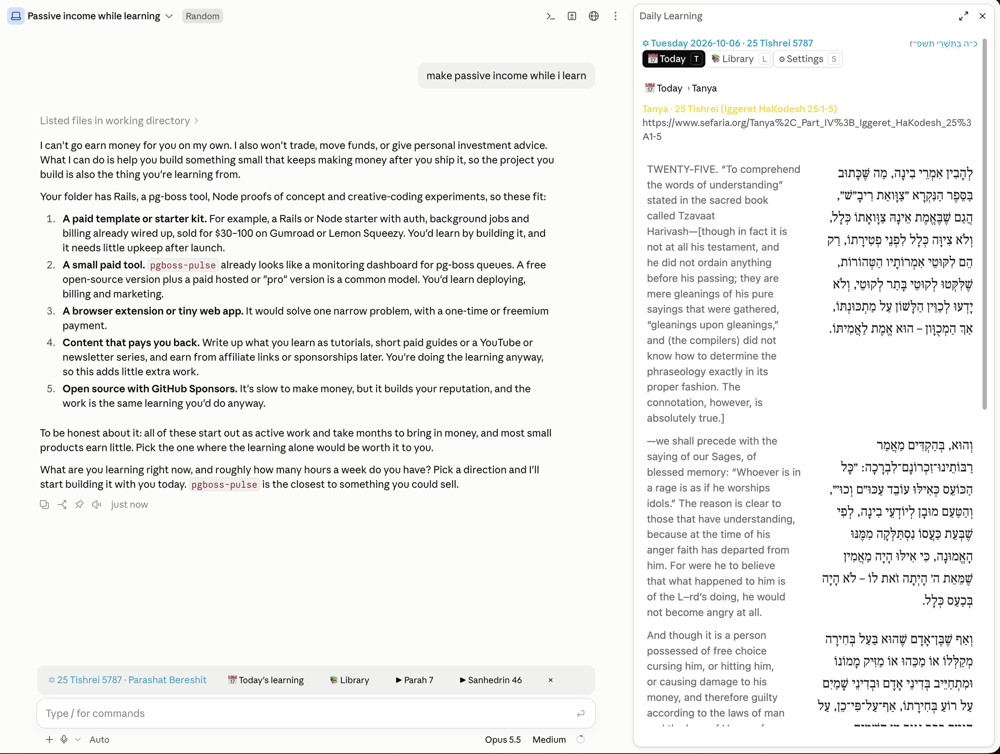

# Daily Learning Plugin

Your daily learning inside [Claude Code](https://code.claude.com/docs/en/plugins/mods/overview): today's Chitas, Rambam, Hayom Yom and Daf Yomi, and a Library of Mishnayos, Shas and Mishneh Torah to learn through at your own pace, in Hebrew that reads right. · **[Website](https://www.sharshi.com/daily-learning-plugin/)**

## Install

In a Claude Code session:

```
/plugin marketplace add sharshi/daily-learning-plugin
/plugin install dl@daily-learning
```

Then `/dl` opens the sidebar. Needs Claude Code 2.1.286+ and `python3`.



## Today

```
✡ 25 Tishrei 5787 · Parashat Bereshit   📅 Today's learning   📚 Library   ▶ Ketubot 5   ×
```

One line above the prompt: today's date, **📅 Today's learning**, **📚 Library**, and **▶** where you left each Library collection. Each opens the sidebar there; **×** hides the line until tomorrow.

### While Claude works

On a longer-running task, the same line offers to fill the wait:

```
⏳ Claude's working. Learn while you wait:   ▶ Ketubot 5   📅 Chumash + Rashi   later
```

**▶** picks up where you left the Library; **📅** opens the next part of today you haven't read yet (or Today's learning, once you've opened them all). Either one opens the sidebar right there. **later** puts the launcher back.

- It appears once a turn has run **45 seconds**, and never takes the keyboard, so you can keep typing.
- When Claude finishes, it's gone, and a quiet "Claude is done" toast lets you know.
- It shows at most once every 30 minutes, and never on a day you've hidden the line with **×**.
- **While Claude works** in ⚙ Settings: after 45 seconds, after 2 minutes, or off.

In the sidebar, **📅 Today** is a menu of the day's sections; each opens into its full text, and **next ›** walks through the day in order:

- **Chumash**, the day's aliyah, with Rashi under each verse
- **Tehillim** on the Chabad monthly cycle
- **Tanya**, the whole day's portion
- **Rambam** ×1 and ×3, perek by perek, each halacha numbered **א. ב. ג.**
- **Daf Yomi**, amud by amud, with Rashi on each passage
- **Hayom Yom**, when Sefaria has it

## Library

**📚 Library** (`l`) is for learning through whole works:

- **Mishnayos**: 63 masechtos, perek by perek
- **Shas**: the Bavli daf by daf, with Rashi
- **Mishneh Torah**: 14 sefarim, hilchos perek by perek

Pick a collection, a seder or sefer, a masechta or hilchos, then a perek or daf. **Continue** picks up where you left each one, in any session; **next ›** runs straight on into the next masechta. Texts load from Sefaria only when you open them.

## Hebrew that reads right

- **Fonts**: Frank Ruhl (default) or Shlomo, bundled, with nikkud. Te'amim are left out.
- **English**: off, under each paragraph, or side by side. Rashi's English too (Rosenbaum & Silbermann).
- **Every surface**: the Desktop app draws each reading with the font built in; Ghostty gets every letter placed and its Hebrew mapped to the font; macOS Terminal is best effort (it reorders Hebrew itself).

All of it is on the sidebar's **⚙ Settings** page (`s`), and in `/config` under dl.

## Commands and keys

| | |
|---|---|
| `/dl` | Open the sidebar |
| `/dl-toggle` | Hide or show the line above the prompt |
| `/dl:text` | Print today's text in the chat, to ask Claude about it |
| `t` `l` `s` | Today, Library, Settings |
| `1`–`7` | A section from today's menu |
| `j` `k` | Next, previous (perek, amud, daf) |

## Sources

Texts and calendar from [Sefaria](https://developers.sefaria.org/), the Hebrew date from [hebcal](https://www.hebcal.com/home/developer-apis), with [chabad.org](https://www.chabad.org/dailystudy) as a fallback.

## Develop

```sh
claude --plugin-dir .      # run from a clone; edits apply on /reload-plugins
claude plugin test .       # tests
claude plugin validate .   # what the mod does, and anything the engine would refuse
```

`hooks/register.tsx` is the mod (line, sidebar, fetching); `hooks/data.ts`, `library.ts`, `hebrew.ts` and `svg.ts` are pure helpers it draws with; `scripts/dl.py` fetches the day's text. An installed copy is a snapshot: bump `version` in `.claude-plugin/plugin.json`, then `claude plugin update dl@daily-learning`.

## License

Code: MIT ([LICENSE](LICENSE)). Fonts: SIL Open Font License 1.1, Shlomo © SIL International and Shlomo Orbach, Frank Ruhl Libre © The Frank Ruhl Libre Project Authors ([fonts/](fonts/)).
